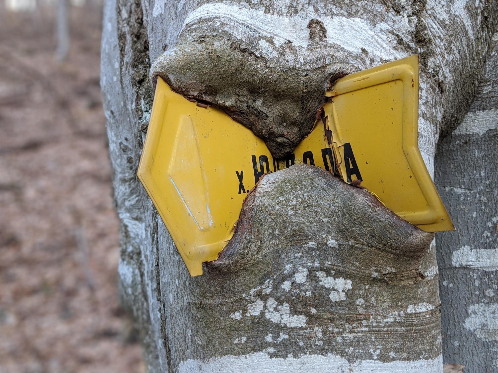

# Примери и практични съвети

## Залагане на гъвкавост при изработването на маркировъчен план

Преди да се премине към маркиране на даден район, трябва добре да се помисли какъв ще бъде моделът за маркиране, с оглед на бъдещо развитие на района.

Ако това не се направи - пример - в даден район маркиращата организация решава, да маркира два туристически веломаршрута, като ги счита за напълно достатъчни и в района не би трябвало да има повече варианти. Тъй като маршрутите са кръгови и се припокриват в малък участък, се взема решение целите маршрути да се означат с два различни номера, а не да се разделят на отсечки. Изработват се информационни табла, маркировка, дипляни и т.н. 

По-късно обаче се появяват повече дейни колоездачи в организацията и споделят, че след проучване са намерили повече вариации и нови маршрути, които искат да се маркират. Поради факта, че първоначалният план е различен и не позволява развитие на мрежата, се налага:

*   цялостно ново планиране на маркировката в района;
*   сваляне на цялата или част от старата маркировка;
*   подмяна на информационните табла;
*   раздадените дипляни объркват посетителите, които вече са карали по маршрутите, но вече маркировката е различна от това, което имат те на картите/дипляните.

За да се избегне такова развитие, отново, е добре се мисли в перспектива. 

## Варианти за изработка на маркировката

Знаците е препоръчително да се изработват от ламарина, но са възможни и други варианти като например: дървени, разпенено ПВЦ, боя нанесена с шаблони по дървета и камъни (само по изключение). Всички тези варианти имат плюсове и минуси, но основните преимущества на ламарината са, че е по-трайна и устойчива на вандализъм. Ако се използва ламарина, има 2 основни варианта - табелки, върху които се лепи фолио с цвета и номера или директен печат върху ламарината. Ламарината е и най-скъпият вариант. В случай, че не разполагате с толкова средства може да помислите за изработка на дървени табелки прахово боядисани върху които да се лепи фолио. Друг вариант е разпененото ПВЦ - евтино, но не особено издръжливо. Понякога при липса на дървета или други обекти, върху които да се сложат табелки, или чести случаи на вандализъм, е възможно в тези участъци да се нанесат триъгълниците с боя. Ако това е в кратък участък, може да не се полагат цифрите, защото е трудно да се изработят такива шаблони.

Фирми, които извършват горните услуги на прилични цени и добро качество:

*   Atia print - принтиране и нарязване на разпенено пвц и също информационни табла на ПВЦ - [https://www.atiaprint.bg/](https://www.atiaprint.bg/)
*   Микони - изработка на ламаринени табелки с фолио - [https://mikoni.bg/](https://mikoni.bg/)
*   Торнадо - боядисване на ламаринени табелки - [http://tornado-bg.net/](http://tornado-bg.net/)
*   Трафик и пътна сигнализация -  цялостна изработка на ламаринени табелки - [http://trs-bg.com/](http://trs-bg.com/)

## Шаблони за изработка на маркировката

Шаблоните са във векторен формат изработени с Adobе Illustrator. Включват слой cut path. Препоръчително е да се консултирате със специалист предпечатна подготовка при подготвянето на маркировката. 

**[ШАБЛОНИ](https://drive.google.com/file/d/15gNQr7i82IEFehT_TG-lGyYP817O_MEb/view?usp=sharing)**

Допълнителни съвети:

*   Задължително условие на всички печатници е предоставените им векторни файлове да бъдат с включен слой “cut path”, за да може впоследствие изработената маркировка да се нареже чрез рутер или друго устройство. 
*   Силно препоръчително е файлът да бъде изпратен в криви (curves), защото понякога, поради разлика във версиите на използваните програми или липса на шрифтове, се получават разлики в отпечатания продукт.

Цветове на маркировката за печат:

*   зелено - #199746 CMYK: 84 16 100 3
*   синьо - #0b70bd CMYK: 87 54 0 0
*   червено - #af2b2b CMYK: 22 97 93 13
*   черно - #000000 CMYK: 75 68 67 90

## Технически съвети при поставяне на маркировката

Маркировката може да се поставя чрез пирони и винтове. Дървото расте постоянно и обикновено започва да “поглъща” табелката след време. Затова е нужно да се използват дистанционери - дистанционни втулки около 2 см (евентуално е възможно да бъдат заменени с гайки). Пример:

*   При използване на винтове: добър вариант са “торнадо” винтовете, които са по-лесни за употреба. Ако не се използват дистанционери, през около 2 години трябва да се отвиват по малко винтовете на нужните места. 
*   При използване на пирони - забиването може да увреди повърхността на табелките, от друга страна, ако се използват по-малки пирони, дървото ги избутва с времето заедно с табелката и не са нужни дистанционери.   

## Допълнителни съвети за развиване на велозони

Други добри практики, които е добре да се прилагат:

*   На местата, където започват пътищата, водещи до пътеките, или на място начало на няколко пътеки (т.н. trailhead) e добре да се поставят големи информационни табла с детайлна информация за маршрутите и карта на региона. Допълнителни информация също би била полезна - забележителности, снимки, подходящи сезони за района, контакти на маркиращата организация, контакти на местни извозващи до пътеките, qr линкове за детайли за всеки маршрут и и т.н. Пример за такова табло до [вр. Милеви скали](https://drive.google.com/open?id=1mXP6d9BmWMejzedSakMfoKWEioVAA-FF) 
*   Уеб сайт на региона, даващ подробна информация за пътеките и маршрутите: освен основната информация, клипове, снимки, възможна интеграция със социални мрежи като страва и т.н. 
*   Популяризирането на дадена зона би следвало да става по много канали: фейсбук, инстаграм, събития, статии в медиите и т.н.