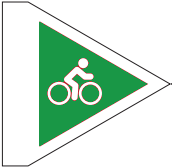
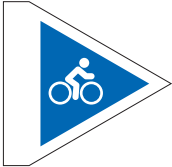
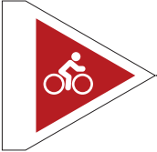
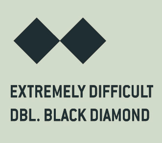
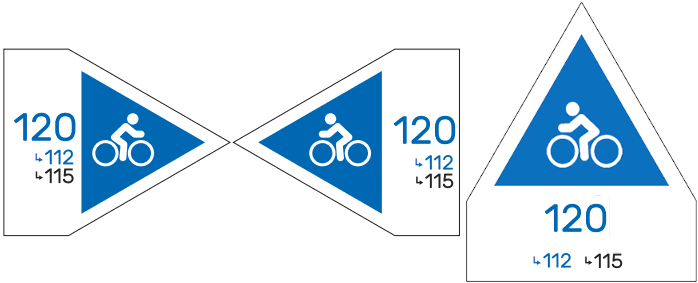
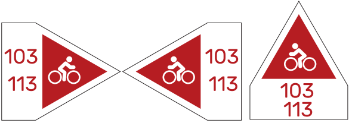
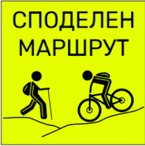

# Въведение

Необходимостта от създаване на единен стандарт за класификация и обозначаване на маршрути за планинско колоездене се налага по следните причини:

1. Увеличаване броя на практикуващите планинско колоездене, както и на клубовете и организациите, работещи за създаването на маршрути и центрове за планинско колоездене;
2. Липсата на общоприета норма в това отношение и съответно липсата на законова база, легализираща съществуването на трасетата за планинско колоездене;
3. Опазване и бъдещо развитие на национална система от маршрути за планинско колоездене;
4. Повишаване безопасността на практикуващите планинско колоездене от гледна точка на по-лесна ориентация;
5. Създаване на унифицирани условия, важащи за всички части на страната, което да доведе до намаляване на хаоса от “маркировки” в планините;
6. Решаване на въпроси, свързани със собствеността и ползването на терените, върху които са развити маршрутите.

Преди да започнете, имайте предвид следното: 

1. Планирайте създаването на нови маршрути за планинско колоездене като част от цялостното развитие на определен регион/община/населено място и в контекста на вече съществуващи туристически или веломаршрути, както и в съответствие с нагласите на местното население и нуждите на ползвателите (велотуристите/планинските колоездачи). Създаването на отделни маршрути “на парче” може да доведе до сериозни проблеми и затруднения при бъдещо развитие на адекватна мрежа от маршрути за планинско колоездене. 
2. Създаването и маркирането на маршрути за планинско колоездене трябва да става в съответствие със законодателството на Република България, плановете за управление на защитените територии, горскостопанските планове, устройствените планове на населените места, стратегиите за развитие на туризма (местни, регионални и национални) и след съгласуване със съответните компетентни държавни и общински органи на управление и техните администрации, както и с частните собственици, през чиито територии преминават маршрутите. 
3. Изборът на материали и места за поставяне на маркировъчните знаци трябва да е максимално щадящ за околната среда и съобразен с особеностите на терена и с множество други фактори. Полагащите маркировката трябва да са запознати с правилата и методиката за маркиране. 
4. Дейностите по маркиране на маршрутите трябва да бъдат последвани от информационно обезпечаване и популяризиране чрез пътеводители, уеб страници и др. 
5. Много е важно още при планирането на маршрутите да се заложи механизъм и отговорност за тяхното поддържане след това. Принципът е, че  отговорността за последващата поддръжка на трасетата се носи от инициатора на дейността и е добре той да подсигури дългосрочни партньорства с местните органи на управление и администрация, местния бизнес и местната колоездачна общност, за да може редовно и ефективно да осъществява дейностите по поддръжка. 

За повече подробности относно тези теми погледнете [секция "Полезни съвети"](./advices), където ще намерите много полезна и проверена в практиката информация.

# Национална организация

За да има координираност между маркиращите организации, и за да се осигури съответствие със стандарта и високо качество на крайния продукт, е наложително да се избере настояща, или да се създаде нова, национална организация, която да обединява организациите, желаещи да маркират районите, които поддържат.

Такава към момента няма избрана или създадена, но за целите на документа, ще бъде реферирана като "Координиращата Организация".

# Правилник за маркиране

## 1. Основни понятия

### Отсечка (сегмент) и маршрут

Представената методика за маркиране и обозначаване на маршрути за планинско колоездене залага на модел, при който се определят и маркират ключови **“отсечки”** в даден район, които след това се комбинират в **“маршрути”**. Всяка отсечка може да участва в повече от един маршрут. Този модел предполага предварително планиране на цял район (зона за каране) и има редица предимства:

*   позволява максимална гъвкавост и икономичност на маркировъчни знаци при маркиране на припокриващи се маршрути
*   позволява ясно маркиране на отсечки с различна трудност, когато маршрутите съдържат такива
*   позволява на потребителите на маршрутната мрежа да комбинират свои маршрути
*   позволява еволюция на маршрутната мрежа в даден район

**Отсечка** е един или комбинация от няколко свързани отрязъци, които имат ясно начало и край и относително консистентен характер като терен, наклон, трудност. Отсечката обикновено свързва две ключови точки от даден район - например населени места, големи кръстовища, забележителности, хижи, заслони, начало/край на пътека и други. 

Комбинация от свързани отсечки представлява **маршрут**. Маршрутите обикновено следват някаква логика - комбинират отсечки с подобна трудност, или с такава дължина, че да предложат полудневни или целодневни комбинации, или предлагащи панорамна/живописна обиколка на даден район. Те не са маркирани като такива, а са описани в табла, карти, пътеводители, уеб-сайтове и други места като комбинации от маркирани отсечки. 

Маршрутите трябва да започват и да завършват на удобни за целта места - населени места, хижи, паркинги, точки от републиканската пътна мрежа, за да могат да бъдат удобни за употреба.

Когато маршрутите започват и завършват на едно и също място те се наричат **кръгови маршрути**.

При определянето на отсечки за даден район, е важно да се търси баланс между твърде “едри“ и твърде “дребни” отсечки, като нито едната крайност не е практична. Твърде много на брой, много къси отсечки прави маршрутите объркващи и трудни за следене и ориентиране. Твърде малко на брой, много дълги отсечки ограничава възможностите за предлагане на разнообразни маршрути в района.

За формиране на отсечките, и оттам маршрутите, могат да се използват пътища (черни и асфалтови), пътеки (естествени и изкуствено създадени), специализирани велосипедни трасета.

### Тематични маршрути

Тематичните маршрути представляват комбинация от пътища и пътеки, които са маркирани самостоятелно и без пряка връзка с маркираните отсечки и съставените чрез тях маршрути. Те обикновено представляват еднодневни или многодневни преходи, които са добили широка популярност покрай събития или поради други причини. Тематични са и маршрутите от национално значение, прекосяващи или обикалящи цели планини или свързващи няколко региона. В тази категория попадат маршрути като: “Ком - Емине” (на този етап не е обособен като маркиран маршрут), “Рудопия”, “Трансродопски веломаршрут”, “Зелена Странджа”, “Обиколката на Витоша” и т.н.

Маркирането на тематичен маршрут е допустимо само по изключение, защото наслагването на повече такива маршрути в един и същи район води до пренасищане с маркировъчни знаци, а понякога и до объркване за потребителите.

Създаването на такъв маршрут подлежи на съгласуване и одобрение от Координиращата Организация.

### Байк център

“Байк център” е населено място или курорт, което представлява начална точка и обслужващ център на мрежата от вело трасета и маршрути, съставящи съответната “Байк дестинация”. В идеалния вариант в “Байк центъра” се развиват следните дейности:

*   маркиране и поддръжка на прилежащите вело трасета;
*   предоставяне на актуална информация за наличните трасета и маршрути - това става посредством информационни табели, уеб сайт, директен контакт с представители на организацията, която развива съответната “Байк дестинация”;
*   предоставяне на услуги - водачи, транспорт, сервиз, настаняване.
*   провеждане на събития, свързани с популяризиране на дестинацията.

### Байк дестинация

“Байк дестинация” представлява мрежа от маркирани / разработени трасета и маршрути за планинско колоездене. Респективно “Байк дестинацията” се “обслужва” от прилежащия “Байк център”, който представлява и изходна точка за посещение на дестинацията. 

“Байк дестинацията”:

*   се състои от максимум 50 отсечки;
*   носи името на обслужващия “Байк център”;
*   принадлежи към административната единица, към която принадлежи нейния “Байк център”;
*   обхватът ѝ може да надхвърля административните граници на една община или област;
*   препоръчително съдържа трасета и маршрути с различно ниво на трудност и предназначение. Същите се планират по такъв начин, че да позволяват различни комбинации при формирането на маршрути;
*   препоръчително не се припокрива със съседна “Байк дестинация”.

## 2. Асфалтови пътища, черни пътища, пътеки, специализирани велосипедни трасета.

Както споменахме по-рано, за отсечки и маршрути могат да се използват части от различни видове пътища и пътеки.

**Асфалтовите пътища** са пътища с асфалтова настилка. Понякога те са най-удобния, или дори единствения начин да за преминаване през даден участък от даден район. Съответно, това, че са асфалтови не трябва да ни спира да ги използваме за маркиране на отсечки и маршрути.

**Черните пътища** (още “почвен път” или “коларски път”, “горски път”) представляват пътища без асфалтова настилка, достатъчно широки за да може по тях да се придвижват каруци, автомобили и където е приложимо, камиони.

**Пътеките** представляват пътища, предвидени за придвижване пеша. Те обикновено са по-стръмни, по-тесни и с неравна настилка. По своя произход можем да ги разглеждаме като:

*   Естествени - животински или създадени от местното население с транспортна цел (обслужване на прилежащи ниви/гори и други стопански площи и/или свързване на населени места и местности)
*   Изкуствено създадени  - еко пътеки и специално създадени туристически пътеки

**Специализираните велосипедни трасета** представляват най-общо пътеки, които са създадени или преправени, включително чрез добавяне на специални технически елементи от естествени или изкуствени материали, за да се практикува по тях планинско колоездене. 

## 3. Определяне нивото на трудност на отсечките и маршрутите

Нивото на техническа трудност на маршрута или отсечката се определя чрез следната таблица, отразяваща различни характеристики на терена и препятствията/елементите на трасето:

|   | Ниско ниво на трудност | Средно ниво на трудност | Високо ниво на трудност | Екстремно ниво на трудност |
|-|-|-|-|-|
| Маркировъчен знак |  |  |  |  | 
| Среден наклон | Не повече от 5% | Не повече от 10% | Не повече от 20% | Повече от 20% |
| Максимален наклон | Не повече от 15% | 15% или повече | 15% или повече | 15% или повече |
| Постилаща повърхност | Твърда или стабилна настилка. | Твърда или стабилна, допускат се отделни участъци с нестабилна настилка. | Стабилна или променлива | Променлива или непредвидима |
| Ширина на следата | Не по-малко от 90 см | Не по-малко от 60 см | Не по-малко от 30 см | Не по-малко от 15 см |
| Естествени препятствия и технически елементи | Може да има неизбежни препятствия с височина не повече от 5 см.   Може да има по-големи препятствия, стига да са заобиколими.   Може да има мостове, които не могат да бъдат избегнати, с широчина не по-малко от 90 см. | Може да има неизбежни препятствия с височина не повече от 20 см.   Може да има по-големи препятствия, стига да са заобиколими.   Може да има мостове, които не могат да бъдат избегнати, с широчина не по-малко от 60 см.   Може да има заобиколими технически елементи с височина до 60 см и широчина не по-малка от 30 см. | Може да има неизбежни препятствия с височина не повече от 40 см.   Може да има по-големи препятствия, стига да са заобиколими.   Може да има мостове, които не могат да бъдат избегнати, с широчина не по-малко от 60 см.   Може да има заобиколими технически елементи с височина до 120 см и широчина по-малка от 60 см. | Може да има неизбежни препятствия с височина повече от 40 см, но е препоръчително да са заобиколими чрез по-лесна линия.   Може да има мостове, които не могат да бъдат избегнати, с широчина 60 см или по-малко.   Може да има технически елементи (заобиколими или не) с височина 120 см  или повече и с широчина над 15 см. |
| Съответствие по системата на IMBA |  |  |  |  |
| Съответствие по системата, разработена от MTB-BG.com | R1, R2 (в зависимост от характеристиките), Т1, T2 (в зависимост от характеристиките) | R2 (в зависимост от характеристиките), T2 (в някои случаи), Т3 | R3, T4 | T5 |

**Важно!** Трудността на маршрутите се определя чрез трудността на терена при спусканията, освен ако тя не е по-ниска от тази на изкачванията. При определяне на трудността на маршрута или отсечката се вземат предвид преобладаващите характеристики на терена. Това означава, че е възможно отделни участъци да превишават посочената трудност, но при спазване на следните кумулативни изисквания:

*   Превишението да е с не повече от едно ниво;
*   Дължината на отделните такива участъци да не е по-голяма от 30 м;
*   Общата дължина на по-трудни участъци да не е повече от 5% от цялата дължина на отсечката или спускането (при определяне трудност на маршрут). 

**Определения:**

*   **Ширина на следата** – това е средната широчина на активно използваемата част от пътеката/трасето.
*   **Постилаща повърхност (настилка)** – материалите и стабилността на постилащата повърхност са ключов фактор при определяне нивото на трудност. Могат да бъдат разграничени следните типове постилаща повърхност:
    *   _твърда_ - асфалт, паваж, макадам (в добро състояние);
    *   _стабилна_ - добре утъпкана почва, гладка скала и други подобни;
    *   _променлива_ - включва всякакви видове, включително ронлива/нестабилна настилка в отделни участъци, но промените в настилката са лесно забележими и предвидими;
    *   _непредвидима_ - включва всякакви видове, като или преобладава ронлива/нестабилна настилка, или промените в настилката са неочаквани и резки, трудно забележими и предвидими.
*   **Максимален наклон** - определя се от най-стръмната част на трасето, която е не по-къса от 5 метра и не е дублирана от по-лесна линия. Измерва се в проценти с помощта на клинометър или чрез измервания и изчисление на терен.
*   **Среден наклон** - отразява денивелацията за цялата дължина на трасето. Средният наклон на трасето се изчислява, като се раздели общата денивелация на трасето на общата дължина (в метри) и се умножи по 100.
*   **Естествени препятствия и технически/изкуствени елементи на трасето.** Тук се включват камъни, коренища, паднали дървета, дупки, издатини, прагове, падове, специално изградени/оформени елементи от естествени или изкуствени материали (виражи, скокове, бабуни, дървени рампи и съоръжения, мостчета и др.). Височината на препятствието се измерва от нивото на постилащата повърхност до най-високата точка на препятствието. Когато препятствието е с различна височина, се измерва най-ниската такава, по която може да се кара. Широчината на препятствието се измерва в най-тясната му част. 

## 4.  Създаване на система за класифициране на отсечки и маршрути 

За координирано класифициране и поддържане на актуален каталог с маркирани отсечки и маршрути, екипът на проекта разработва единна онлайн система за целта.

При създаване на маркировъчен план за нова Байк Дестинация, в системата ще се извършва регистрация на организацията, извършваща маркирането. Организацията ще посочва "Байк Центъра", около който ще се развива маркировъчния план.

Системата, на база географска информация за:
* администартивната област, към която принадлежи населеното място - център на Байк Дестинацията
* други, вече маркирани маршрути и отсечки в съседство

ще издава 50, последователни номера за обозначаване на отсечки.

Ако даден район изисква повече от 50 отсечки за маркиране, то по-доброто решение е той да се раздели на 2 района или повече, тъй като при над 50 отсечки, моделът става повече объркващ, отколкото гъвкав.

По този начин, ще се избягват конфликти и съвпадения на номера на отсечки в съседни райони.

След създаване на системата и въвеждането и в експлоатация, този текст ще бъде ревизиран, за да описва процедурата за регистрация и получаване на номера за отсечки.

## 5. Графични знаци за маркиране

Знаците, които се използват за обозначаване на отсечките и маршрутите биват 3 основни вида:

*   триъгълници с номер 
*   по-големи табели даващи повече информация
*   спомагателни табели

### Триъгълници

Използват се за маркиране по цялото протежение на отсечките. Разделят се на два типа:

*   с един номер в триъгълника: могат да бъдат леви, десни, направо. Посоката се определя според нуждите/възможностите за маркиране на конкретната отсечка. Размерите са 15 см височина, 16 см дължина: 

*   с повече от един номер в триъгълника: могат да бъдат леви, десни. Посоката се определя според нуждите/възможностите за маркиране на конкретната отсечка. Размерите на триъгълника са 15 см височина, 18 см дължина. Този тип триъгълници могат да се използват, когато имаме отсечка на която искаме да покажем какви са вариантите отбиващи се от нея (основно това са пътища използвани за изкачване).

 

### Табели

Табелите трябва да се поставят в началото на отсечките и маршрутите и при разклонения. Възможно е да има табели при нужда и по протежение на отсечката. Табелата дава по-детайлна информация за отсечката или маршрута. Основните елементи в една табела са:

*   номер на отсечката
*   наименование на отсечката или тематичния маршрут
*   до кои отсечки води (кои се отклоняват от нея)
*   възможна допълнителна информация - дължина, денивелация, трудност, QR код, лого на маркиращата организация

 
 

Размерите на табелите са: височина - 12 см, широчина 40 см, широчина на правоъгълника 30 см.

### Спомагателни табели

##### Опасен участък

Поставят се непосредствено преди опасен участък или рязка промяна на трудността на пътеката или пътя. Размерите са 15 x 15 см. 

 

##### Грешна посока

Поставят се при разклонения, където не е ясно коя е правилната посока или логичното продължение на пътя/пътеката не следва маркираният маршрут.. Размерите са 15 x 15 см.

 

##### Споделен маршрут

Табелите за споделен маршрут следва да се използват само в случаите, когато това е необходимо за избягване на конфликтни ситуации, като се следва принципа за минимална наситеност, т.е. знаците се поставят в началото на отсечката и при пресичането ѝ с други пътеки или пътища. Поставят се при маркиране на отсечки, които се използват активно и за пешеходен туризъм, без значение дали става дума за маркирани туристически пътеки, или не. Препоръчително е решението за това кои отсечки да бъдат обозначени и с такива табели да бъде взето след съгласуване с местните туристически дружества и със стопаните на съответната територия. 

 

### Тематични маршрути

Тематичните маршрути винаги се маркират с червен цвят. Когато се използват табели, на тях се изписва името на маршрута. Когато се използват триъгълници, на тях се изписва код (съкращение) от букви и цифри, който е уникален за съответния тематичен маршрут и се получава в процеса на съгласуването му. 

Пример - маршрутът на популярното “Витоша 100” би бил маркиран с червени триъгълници с код “**В100**”.

## 6. Указания за полагане на маркировката

При полагане на маркировката трябва да се спазват следните правила:

*   маркировка се полага върху дървета, стълбове, огради (след разрешение от собственика);
*   маркировка се поставя на обекти, разположени в близост до пътеката;
*   при равни участъци или изкачване маркировка се поставя на височина 1.5 - 2 м;
*   при участъци на спускане маркировка се поставя на височина до 1.5 м;
*   при полагане на маркировка да се избягват места, които са или предстои да обрастнат с растителност
*   когато се припокриват няколко отсечки, е необходимо да бъдат поставени отделни маркировъчни знаци за всяка. В рамките на маркировъчния знак се вписват означенията на всеки от тях с букви, цифри или и двете. Обикновено такава ситуация се получава в началото на маршрутите в рамките на съответното населено място / изходен пункт;
*   честотата на маркиране се увеличава в близост до и след всеки разклон, обрасли с растителност участъци, и открити места - при такава ситуация е необходимо да се поставят знаци през интервал от 20 - 30 м. Същото важи и при при резки или неясни отклонения на маршрута;
*   когато пътят / пътеката е ясно откроена и без разклонения, честотата на маркиране да е 200 - 300 м.;
*   при наличието на друг маршрут (пешеходен, велосипеден), нанасянето на новата маркировка да не унищожава съществуващата и знаците да се нанасят на същите места, като съществуващите;
*   при припокриване на колоездачна маркировка с пешеходен маршрут, маркировката на колоездачния може да бъде нанесена през по-големи интервали (500 м);
*   при открити и обрастващи места препоръчваме употребата на пилони (дървени или метални). Важно е да е поставен ясен маркировъчен знак в края на откритата местност, където маршрута отново влиза в гората;
*   знакът указващ грешен път на движение (бял квадрат с черен хикс) се поставя в изключителни случаи, когато е налице рязко отклонение на маршрута от досегашната или логична посока на движение. Поставя се и в открити местности или други места, където теренът не позволява нанасянето на ясна маркировка в правилната посока на движение; 
*   от началото на маршрута до изхода на населеното място честотата на маркировката да е през 100 м;
*   в населено място маркировъчните знаци се поставят върху бетонни стълбове, огради (с позволението на собствениците);
*   информационните табла се поставят в началото на маршрута и по протежението му съгласно предписанията в частта за допълнителни обозначения.

## 7. Маркиращи организации - права и отговорности

Правото да подбират и маркират трасета за планинско колоездене имат юридически лица в т.ч. сдружения с нестопанска цел, спортни клубове, търговски дружества, общини, горски стопанства. Физически лица нямат право самостоятелно да провеждат този процес.

Участващите в процеса юридически лица е необходимо да имат предишен опит или ако нямат такъв да проведат предварителна консултация с Координиращата Организация. 

Преди да се премине към разработването и маркирането на даден район е добре проекта да бъде представен и обсъден в Координиращата Организация, за да се избегнат често допускани грешки и да се осигури качество и консистентност в крайния резултат. 

Процесът на консултиране с Координиращата Организация ще бъде описан, след като тя бъде избрана. В него ще бъде включена и процедурата за регистрация и получаване на номера за отсечки от системата, описана по-горе.

Самият процес на разработване на дестинация за планинско колоездене би следвало да премине през следните етапи:

1. Предварително познаване на района в т.ч. теоретично (по карта, пътеводител, предварителна информация) и теренно, т.е. да се провери на място състоянието на пътеките, пътищата и местностите, през които се планира да преминават трасетата.
2. Предварителен избор на трасета - след опознаването на района би трябвало да се направи предварителна планировка на мрежата от трасета. На този етап би трябвало да се помисли за различните типове трасета, тяхната функция, свързаност, ниво на трудност, връзка с други трасета, интересни обекти, места за настаняване и т.н.
3. Проверка на статута на земята, през която преминават планираните трасета - на този етап е необходимо да се провери кой е собственикът на територията, през която преминават трасета. Тя може да бъде частна, общинска или държавна. Едновременно с това е необходимо да се уточни предназначението на тези територии - дали са част от защитена територия, горско или ловно стопанство, зона със специално предназначение. 
4. След установяване на собствеността и статута на територията, през която преминават планираните трасета, е необходимо да бъде получено разрешение от собственика или стопанина на същата. Такова разрешение или съгласуване е необходимо да бъде скрепено със споразумение за партньорство, договор за ползване или друг вид писмено съгласие. Когато трасетата преминават през защитени територии (национални или природни паркове, защитени местности или поддържани резервати), задължително е необходимо съгласуването им с плана за управление на същата (ако има действащ такъв), както и със съответната регионална инспекция по околна среда и води. 
5. След получаване на необходимите разрешения и съгласувателни процедури следва да се премине към конкретното планиране на дейността по маркиране на трасетата. На този етап е необходимо да бъде направена количествена сметка на необходимите материали (указателни табели, пилони, информационни табели, винтове, камъни, цимент, пясък и т.н.) и необходимия брой човекодни за нанасяне на маркировката. Това до голяма степен зависи от спецификата на планирания район - обща дължина на трасетата, наличие на растителност, брой разклони по пътеките и т.н. и може да бъде направено само след добро познаване на всяко трасе.
6. Осигуряване на финансиране за реализирането на дейностите - след изготвянето на количествено - стойностна сметка и преценка на необходимия брой човекодни т.е. след изготвянето на общ бюджет на дейностите, е необходимо да бъде подсигурено необходимото финансиране. Това финансиране може да има различен произход - собствени средства, целево фондонабиране (кампанийно), финансиране по проектна програма, спонсорство, договор за подпомагане и т.н. \
Самата реализация на дейностите трябва да започне едва след като е подсигурено необходимото финансиране.
7. Формиране на екип за реализация на дейностите - преди да се пристъпи към самото маркиране, е необходимо да бъде формиран екип от хора, които ще извършат самото маркиране. Тези хора би трябвало да познават добре района и планираните трасета и съответно да имат необходимите познания за това как се поставя маркировката. Ако нямат предишен опит, е препоръчително да се обърнат към БКЛ и да бъде проведен кратък обучителен курс.
8. Полагането на маркировката трябва да се планира за подходящ период от годината (обикновено пролет) и съответно да бъде предшествано или реализирано успоредно с дейности по почистването на пътеките от паднали дървета, клони и храсти.
9. След полагането на маркировката е необходимо трасетата да бъдат документирани, в т.ч. записани с GPS, описани в текстов формат, фото и видео заснети. Съответно тази информация е необходимо да бъде предоставена на БКЛ за въвеждане в националната база данни на трасетата за планинско колоездене, както и на собственика (стопанина) на територията, през която са прекарани трасетата (горски и ловни стопанства, общини). Снимките и видео материали са добър ресурс за последващото популяризиране на района.

Когато маршрутите преминават през територии, управлявани от горски или ловни стопанства, е необходимо да бъдат отразявани или взети предвид при изготвянето на съответните горскостопански планове, за да не се стигне до унищожението им при дърводобив на по-късен етап.

Отговорността за последващата поддръжка на маршрутите се носи от инициатора на дейността. Практиката показва, че в дългосрочен план поддръжката на маршрутите е процес, който отнема повече време и средства, отколкото самото първоначално поставяне. По тази причина е важно да бъдат търсени дългосрочни партньорства със собствениците / стопаните на терена, през който преминават маршрутите, както и със заинтересованите страни в съответния район - браншови туристически организации, места за настаняване, доставчици на услуги, търговци на велосипеди. Обединението на усилията на изброените по-горе е предпоставка за дългосрочното съществуване на създадената локация за велотуризъм. 

